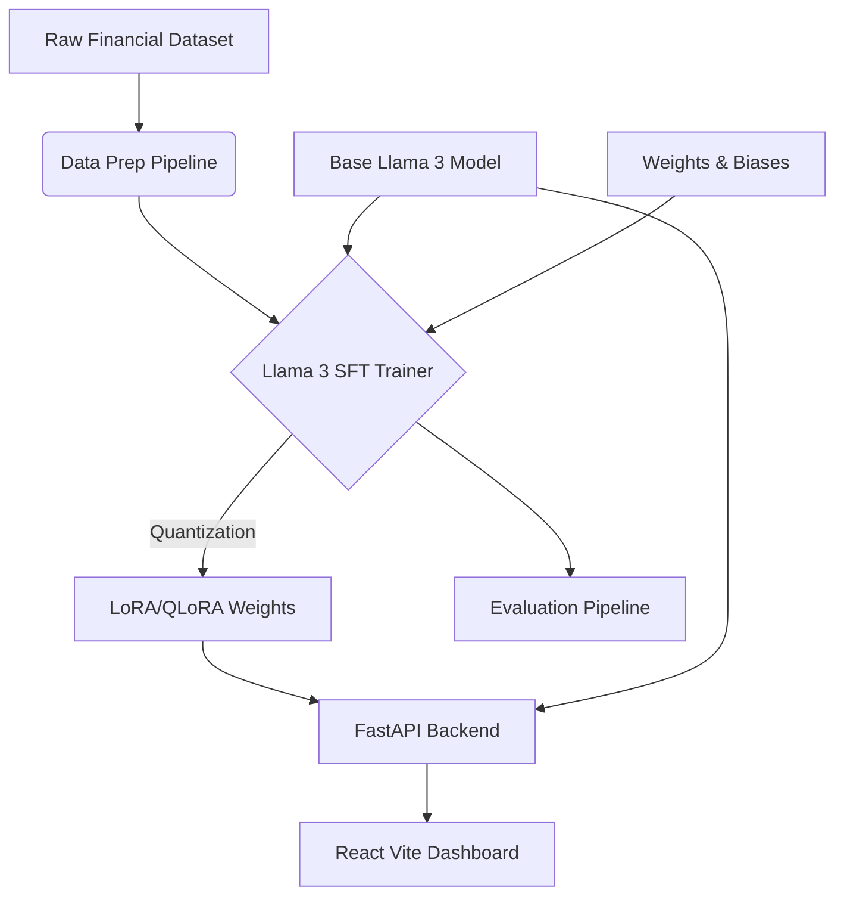

# Llama 3 Domain-Specific Fine-Tuning using LoRA & QLoRA


An enterprise-grade, full-stack Machine Learning project demonstrating the complete lifecycle of adapting **Meta Llama 3 (8B Instruct)** for **Financial Question Answering**.

## 🏗️ Architecture Diagram



## ✨ Features

- **End-to-End Fine-Tuning**: Configurable scripts for LoRA and QLoRA fine-tuning using Hugging Face `TRL` and `PEFT`.
- **Domain Specialisation**: Trained on the `gbharti/finance-alpaca` dataset to provide accurate financial insights.
- **Production-Ready API**: High-performance FastAPI backend supporting model selection, generation, and evaluation metrics.
- **Modern React Dashboard**: A sleek, dark-themed UI built with Vite and React for interacting with the fine-tuned model and comparing it to the base model.
- **MLOps Integrated**: Experiment tracking with Weights & Biases (W&B) and containerized deployment with Docker.

## 🚀 Getting Started

### 1. Prerequisites
- Python 3.10+
- Node.js 20+
- Docker & Docker Compose
- NVIDIA GPU (at least 16GB VRAM for QLoRA training)
- Hugging Face Token (with Llama 3 access)

### 2. Setup Environment

```bash
export HF_TOKEN="your_huggingface_token_here"
```

### 3. Run the Full Stack with Docker

```bash
docker-compose up --build
```
- Frontend will be available at: `http://localhost:3000`
- API docs will be available at: `http://localhost:8000/docs`

### 4. Run Training Locally
To execute the fine-tuning pipeline on your local GPU:
```bash
cd ml_pipeline
pip install -r requirements.txt
python training/train_lora.py
```

## 📊 Evaluation Results

The evaluation pipeline (`eval_metrics.py`) uses Hugging Face `evaluate` to compute generative text metrics (ROUGE, BLEU, BERTScore). W&B charts provide visual insights into training loss and evaluation metrics over time.

## 💼 Resume Highlights

- **LLM Engineering**: Demonstrated expertise in instruction tuning, parameter-efficient fine-tuning (PEFT), and 4-bit quantization (QLoRA) using `bitsandbytes`.
- **MLOps**: Implemented reproducible ML pipelines, experiment tracking, and Docker-based deployments.
- **Full-Stack AI**: Built a complete application integrating Python backend APIs with a React frontend to serve large language models.
